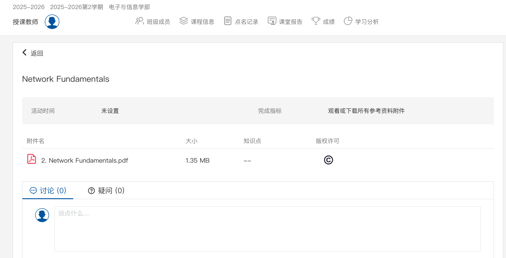

# XJTU Slides Fetcher
## Feature Overview
Supports fetching courseware from the latest version of [SiYuan Xuetang](https://lms.xjtu.edu.cn), including files that do not explicitly expose download interfaces.
## Usage
### Method 1: Using the Browser Console
- Log in to your SiYuan Xuetang, open the corresponding course page, click on "Courseware", click on the specific file interface, and remain on the resulting page as shown below:

- Press `F12` to open the Developer Tools;
- Select `Console`, paste the contents of `original_page_console_script.js` from this repository, and execute it to successfully open the file page. (You may need to disable popup blockers.)

### Method 2: Local Script
- Install the dependencies from `requirements.txt`
    ```bash
    pip install -r requirements.txt
    ```
- Run the script
    ```bash
    python fetch_script.py
    ```
The downloaded files will be saved in the `lms_downloads` directory.
> [!Warning]
> ***Please do not use this tool to download copyright-protected courseware and distribute it freely or for profit!***
