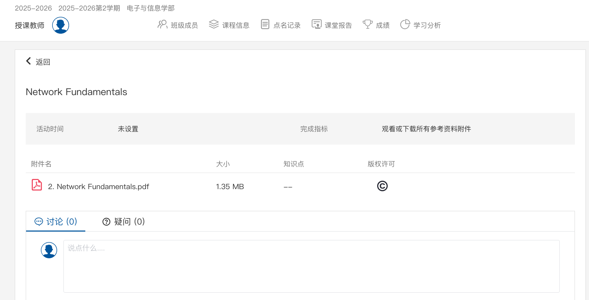

# XJTU Slides Fetcher
## 功能简介
支持从最新版[思源学堂](https://lms.xjtu.edu.cn)抓取课件，包括不显式开放下载接口的课件。
## 使用方法
### Method 1：在网页控制台操作
- 请登录你的思源学堂，并打开对应的课程主页，随后点击“课件”，点击对应的文件界面，最后停留的页面如下：

- 按`F12`打开开发者模式；
- 选择`console`，并输入本仓库中`original_page_console_script.js`的内容，即可成功弹出文件页面。（可能需要关闭拦截弹窗的功能）

### Method 2：本地脚本
- 安装`requirements.txt`的依赖
    ```bash
    pip install -r requirements.txt
    ```
- 运行脚本
    ```bash
    python fetch_script.py
    ```
最后的结果会存放在`lms_downloads`目录中。
> [!Warning]
> ***请不要利用本工具下载具有版权保护标识的课件并随意传播！***